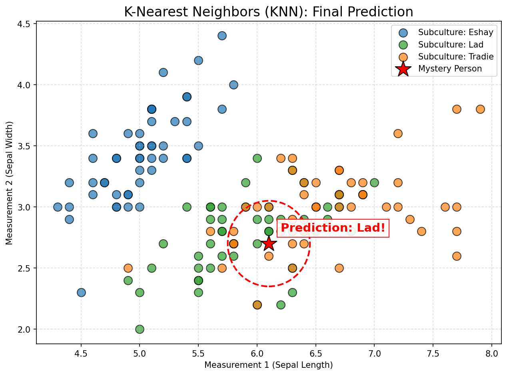

# What is KNN? A Visual Guide

Forget the code for a minute. Let's talk about how K-Nearest Neighbors (KNN) actually makes a decision in the real world.

Imagine you are looking at a map of a neighborhood. You want to buy a house, but you want to know if it's a "dog neighborhood" or a "cat neighborhood".

How would you guess? You would look at the houses *closest* to the one you want to buy. If the 5 closest houses all have dogs, you'd guess your new neighbors are dog people.

## The "Birds of a Feather" Algorithm

KNN works on a very simple premise: **Similar things exist close to each other.**

Look at the image below. I just generated this graph based on the exact same flower data your script is using. The flowers are plotted based on two of their physical measurements.

### The Setup
1. The **blue**, **green**, and **orange** dots are flowers we already know the species of. This is our "Training Data". The computer has memorized their locations on the map.
2. The large **red star** is a "Mystery Flower". We have its measurements (so we know where to place it on the map), but we don't know what species it is. This is our "Test Data".

### The Algorithm in Action
Instead of trying to come up with complex mathematical formulas (like "if length > 5 and width < 3"), KNN does something very human:

1. It finds the **5 nearest** known flowers to the mystery flower. Why 5? Because in your code, you wrote `n_neighbors=5`. That's represented by the red dotted circle.
2. It takes a "vote" among those 5 neighbors.
3. Inside the circle, we see mostly green dots (Versicolor).
4. Therefore, the model confidently guesses that the Mystery Flower is a Versicolor!

> [!NOTE]
> **What does "Accuracy: 100%" mean?**
> When your code output `Accuracy: 100.00%`, it means the computer played this guessing game with a bunch of "mystery flowers" where we *secretly* knew the answer. The computer's guess based on the neighbors matched the *actual* secret answer perfectly every single time!
